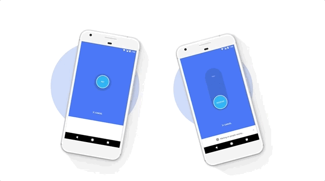

<h2 align="center">
   
  React Native Ultrasonic [Android]
</h2>

# Summary
Use of bluetooth, BLE or even WIFI-Hotspot it such a pain due to incompatibility and unreliability specially when it comes to android Oreo & Pie. However, your mission may be to send some small data to another phone and to do that you would need to write a huge bunch of code including handling many scenarios while you can just use audio technology to do that task seamlessly and without being connected to another phone.

So, let me introduce you ultrasonic library which focuses to send your small data in a fastest and secure way and battery-power free, How could you use this 💥:
* Contactless payment
* Automatic check-in
* Anything nearby you can connect it

## How it works?
 

## Example
🔥 [Checkout](https://github.com/assemmohamedali/react-native-ultrasonic/tree/master/Example) our main example to get started debugging or testing.

## Getting Started
* install it via
~~~ 
npm install react-native-ultrasonic --save
or
yarn add react-native-ultrasonic
~~~

* You would need to link the library once you install it.
~~~ 
react-native link react-native-ultrasonic
~~~

* Then put this lines into `settings.gradle`.
~~~
include ':quiet'
project(':quiet').projectDir = new File(rootProject.projectDir, '../node_modules/react-native-ultrasonic/android/quiet')
~~~

* You need to put a permission to use `RECORD_AUDIO` at `AndroidManifest.xml`.
~~~
<uses-permission android:name="android.permission.RECORD_AUDIO"/>
~~~

* Keep sure you put ndk.dir into your local.properties.
~~~
ndk.dir=/root/ndk
~~~

🔥 You're ready to go!

## Document
<b> ultrasonic.initialize({}) -> Take object of sound type -> Return promise</b>

> Before sending any data you've to call this function to be initialized and ready to send data. You must call it only via sender-side only.

<b> ultrasonic.send({}) -> Take object of payload -> Return promise</b>

> When you're about to send, you call this function to work like a charm sending your data.

<b> ultrasonic.receive({}) -> Take object of sound type -> Return promise</b>

> Before receiving any data you've to call this function to be initialized and ready to receive data. You must call it only via receiver-side only.

To be able to listen for any coming data you have to set these events into your `componentDidMount` and remove them in `componentWillUnmount`

~~~
 componentDidMount() {
        ...

        DeviceEventEmitter.addListener('onPayloadReceived', this.onPayloadReceived);
        DeviceEventEmitter.addListener('onErrorReceived', this.onPayloadReceived);
    }

    componentWillUnmount() {
        DeviceEventEmitter.removeListener('onPayloadReceived', this.onPayloadReceived);
        DeviceEventEmitter.removeListener('onErrorReceived', this.onPayloadReceived);
    }

    onPayloadReceived = ({payload}) => {
        alert(payload);
    }

    onErrorReceived = ({error}) => {
        alert(error);
    }
~~~
* Every sound type below has its own weakness and strength (distance - payload - waves). you can debug to choose the most fit to you

| Function | Object | Types | Default
| --- | --- | --- | --- |
| `initialize` | sound | `ultrasonic.sounds.ultrasonic`   `ultrasonic.sounds.channel_7k_0`   `ultrasonic.sounds.channel_7k_1` | `ultrasonic.sounds.ultrasonic`
| `send` | payload | none | the message you need to send |
| `receive` | sound | `ultrasonic.sounds.ultrasonic`   `ultrasonic.sounds.channel_7k_0`   `ultrasonic.sounds.channel_7k_1` | `ultrasonic.sounds.ultrasonic`

> If you set sound type at sender-side for example `ultrasonic.sounds.ultrasonic`, you must set it as same at receiver-side. otherwise you won't receive anything. 

## What's Next?

* Add beacon sender/receiver (Higher distance)
* Add more sound types

🔥 Feel free to open an issue for a new feature or a bug

## Updates

🚀 [Updates](https://github.com/assemmohamedali/react-native-ultrasonic/blob/master/Updates.md) any upcoming updates will be there.

## Licence

MIT
